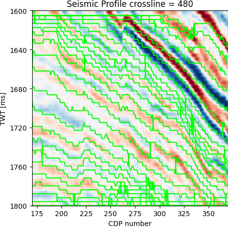
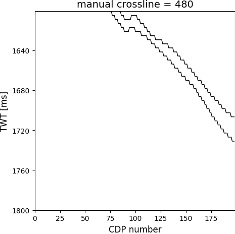

# Quick tutorial — Interpret XL480 (example)

This short, hands-on tutorial shows how to interpret crossline **XL480** from the example subvolume
using the **Lateral Interpretation GUI**. It is intended for quick testing and demonstration;
for full methodological details please read the paper and the GUI *Help*.

## Prerequisites

* You have the repository files on your system and have installed dependencies:

```bash
python -m pip install -r requirements.txt
```

* Example SEGY (small demo) is available at:
  `example_data/F3_Dip_steered_median_subvolume_IL230-430_XL475-675_T1600-1800-CDP170-370.sgy`
* Tutorial images/screenshots are in `tutorial_images/`

---

## Overview of this example

We will:

1. Open the GUI.
2. Load the example SEGY and select crossline XL480.
3. Crop the profile, run the automated Lateral Interpretation pipeline,
   inspect automatic contours, run TSP/onlap/smoothing stages,
   and finally demonstrate a short manual edit step.
4. Save example `.npz` outputs and plots.

---

## Steps

### 1) Prepare and launch

1. From the repository root, check the environment and install if needed:

```bash
python check_env.py
# then, if needed
pip install -r requirements.txt
```

2. Launch the GUI:

```bash
python run_gui.py
```

---

### 2) Load the example SEGY

1. In the GUI, click **Browse** and navigate to:

```
example_data/F3_Dip_steered_median_subvolume_IL230-430_XL475-675_T1600-1800-CDP170-370.sgy
```

2. Set seismic attributes in the main GUI panel before loading:

* **Initial inline/crossline attribute**: `475`
  (the example subvolume crosslines start at XL475; we will study XL480)
* **F3 Time Sample Interval**: keep default `4`
* **x_start**: `170`
* **y_start**: `1600`
* Select the **Crossline** radio button (not Inline)
* Set **Manual interpretation**: `No` (we will revisit manual steps later)

3. Click **Load Selected File**.
   In the file selection window that opens, choose `480` — this loads XL480.

---

### 3) Crop the profile for the study area

On the plotted seismic profile, **click and drag** to select the study window.
Select the *whole* visible profile for this tutorial.


---

### 4) Run Lateral Interpretation — contour extraction

1. Press **Proceed to Lateral Interpretation**.
2. In the new LI window:

* Change **Line Length Threshold** to `10` (50 is too large for this zoomed view).
* Leave other parameters as default.

3. Click **Run contour extraction & save contours.npz**.

A small status window will pop up reporting the number of initial layers detected.

> **Note:** `.npz` outputs are saved to the directory from which `run_gui.py` was launched.

---

### 5) Optional manual merge step (skip for now)

When the contour-extraction canvas opens, you can manually merge or edit layers.
For this quick tutorial, press **Finish Merging** to continue.

---

### 6) TSP, Onlap/Downlap, Vertical smoothing

For each stage:

1. Use default parameters.
2. Click the corresponding **Run ...** button.
3. Outputs (e.g., `tsp.npz`, `onlap.npz`, `smooth.npz`) are saved automatically.

---

### 7) Plot & save interpreted results

1. Go to **More → Plotting**.
2. Choose:

* **Source (npz)**: `feature.npz`
* **Overlay**: `Original`

3. Click **Plot and Save**.



---

### 8) Manual interpretation (short example)

1. Go to **More → Manual Interpretation**.
2. Click a red layer outline to select it, then press **Merge**.


3. Press **Finish**.
4. In the **Contour Detection** dialog:

* **Use Manual Interpretation**: `Yes`
* **Manual Interpretation Type**: `Layer`
* **Lateral Interpretation Setting**: `None`

5. Click **Run**.

Return to **More → Plotting**, choose `manual.npz`, set **Overlay** to `None`, then **Plot and Save**.



---

## Expected files produced

* `contours.npz` — extracted contours
* `tsp.npz` — TSP connection
* `onlap.npz` — onlap/downlap result
* `feature.npz` — features for plotting
* `manual.npz` — after manual edits
* Plot images (`*.png`)

---

## Where to find more detail

* Read the paper: *Lateral Interpretation: A New Method for High Resolution Seismic Stratigraphy*
* Open the **Help** menu inside the GUI for detailed usage notes and credits

